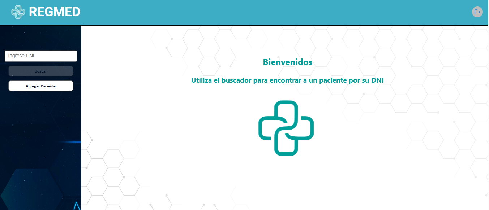
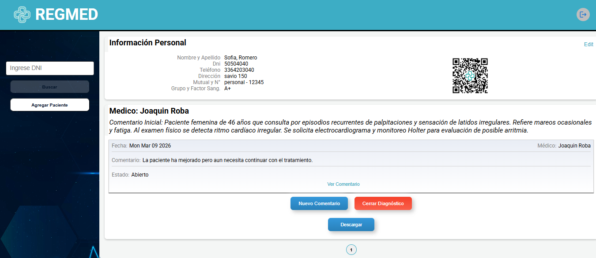
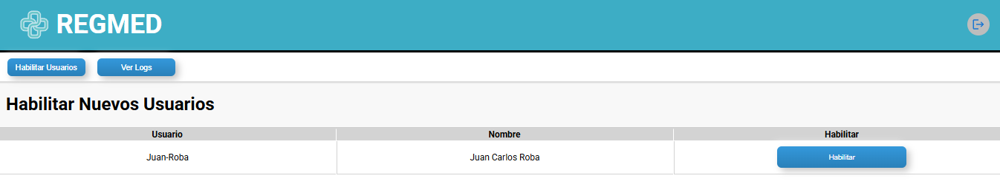

## 📌 Proyecto: **RegMed – Gestión de Registros Médicos**

     
 

---

### 📄 Descripción general

Aplicación web full‑stack para la gestión de pacientes, diagnósticos y log de acciones en un entorno médico.  
Permite a profesionales registrar pacientes, agregar diagnósticos, comentarios y generar resúmenes descargables en PDF. Los registros poseen un **código QR** que apunta a una vista mobile‑friendly.

El backend administra usuarios y autenticación con JWT, control de habilitación por administrador y persistencia en **MongoDB**.  
El frontend SPA en **React + Vite** consume la API del servidor y provee una interfaz moderna con componentes estilizados (styled‑components).

Este repositorio es un ejemplo profesional orientado a mostrar capacidades en desarrollo de aplicaciones web complejas.





### 📑 Tabla de contenido

1. [Características](#-Características)
2. [Tecnologías utilizadas](#-tecnologías-utilizadas)
3. [Arquitectura del sistema](#-arquitectura-del-sistema)
4. [Instalación y ejecución local](#-instalación-y-ejecución-local)
5. [Contribuir](#-contribuir)
6. [Contacto](#-contacto)
7. [Licencia](#-licencia)

---

### ✅ Características principales

- **Registro y login de usuarios** (médicos, administración); contraseñas encriptadas con `bcrypt`.
- **Habilitación de cuentas** por administrador antes de entrar al sistema.
- **Protección de rutas** mediante JWT y middleware `userExtractor`.
- **CRUD de pacientes** con búsqueda por DNI.
- **Gestión de diagnósticos**: creación, edición de estado, cierre y comentarios históricos.
- **Registro de logs** para cada acción importante (creación de paciente, diagnóstico, edición, etc.).
- **Generación de PDF** de resumen de paciente con `jsPDF/html2canvas`.
- **Código QR** asociado a cada paciente para acceso móvil.
- **Vista “móvil”** orientada a dispositivos portables.
- **Interfaz limpia y responsiva** gracias a React y styled‑components.
- Soporte para **roles de usuario** (especialista vs guest).

---

### 🛠 Tecnologías utilizadas

**Frontend**

- React 18 + Vite  
- React Router DOM  
- Styled‑components  
- Axios  
- react‑tag‑input‑component  
- jsPDF, html2canvas  
- qrcode.react  
- Pagination, modals y otros componentes reutilizables  

**Backend**

- Node.js & Express  
- MongoDB (conexión vía mongoose)  
- bcrypt, jsonwebtoken  
- cors, dotenv  
- mongoose‑unique‑validator  

**Base de datos**

- MongoDB Atlas / local (variables de entorno configurables)

---

### 🏗 Arquitectura del sistema

1. **Cliente SPA** en `frontend/` que realiza peticiones `HTTP` a la API.
2. **Servidor REST** (`backend/index.js`) con rutas agrupadas en controladores (`controllers/…`).
3. **Modelos mongoose** (`models/…`) para `User`, `Pacient`, `Diagnosis`, `Log`, `Medicos_Matriculados`.
4. **Middleware** para manejo de errores, rutas no encontradas y verificación de JWT.
5. **Comunicación** con MongoDB mediante `MONGO_DB_URI` definido en `.env`.

La separación frontend/backend facilita el desarrollo independiente y el despliegue en distintos servicios.

---

### 🚀 Instalación y ejecución local

> Se asume que Node.js ≥ 16 y npm están instalados.

#### 1. Clonar el repositorio

```bash
git clone <URL_DEL_REPOSITORIO>
cd regmed-grupal
```

#### 2. Backend

```bash
cd backend
npm install

# crear archivo .env con:
MONGO_DB_URI="tu_uri_de_mongodb"
JWT_SECRET="una_clave_secreta"
PORT=3001

npm run dev   # arranca con nodemon
```

La API quedará escuchando en `http://localhost:3001`.

#### 3. Frontend

```bash
cd ../frontend
npm install

# (opcional) modificar los baseUrl en src/services/* apuntando a la API local
# o usar proxy de Vite.

npm run dev
```

Accede a `http://localhost:5173` en tu navegador.

---

### 🤝 Contribuir

Este repositorio está abierto para forks y mejoras.  
Pasos sugeridos:

1. Forkear el proyecto y crear una rama (`feature/…`).
2. Realizar cambios y abrir un Pull Request con descripción clara.
3. Reportar issues o sugerencias en el repo original.

---

### 📬 Contacto

- **Autor:** Joaquín Leonel Roba  
- **Email:** joaquinleo002@gmail.com  
- **LinkedIn:** [linkedin.com/in/joaquin-leonel-roba-011206281](https://www.linkedin.com/in/joaquin-leonel-roba-011206281)  
- **GitHub:** [github.com/joaquinleo](https://github.com/joaquinleo)

> Disponible para colaboraciones, consultorías y oportunidades profesionales.

---

### 📜 Licencia

Este proyecto se distribuye bajo la licencia **MIT**.  
Consulta el archivo [LICENSE](./LICENSE) para más detalles.

---

## Nota

Este proyecto fue desarrollado originalmente como trabajo grupal junto a otros desarrolladores.  
En este repositorio se publica una copia del proyecto con fines de portfolio personal.